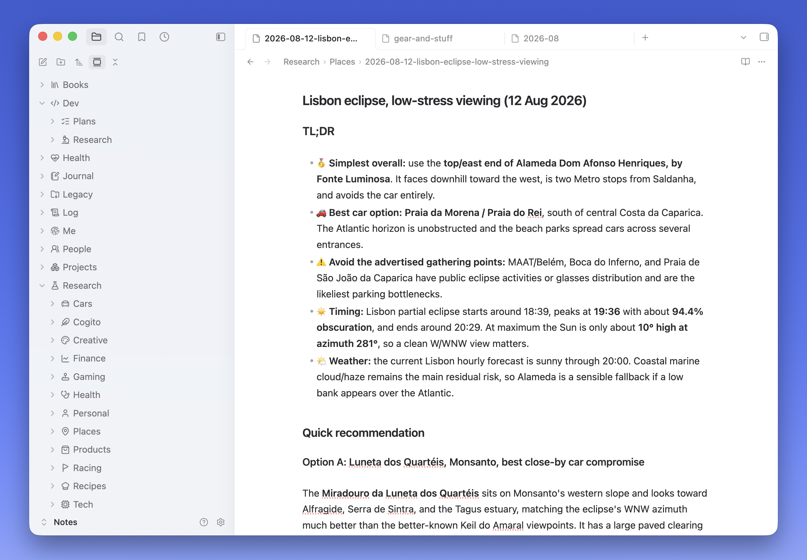
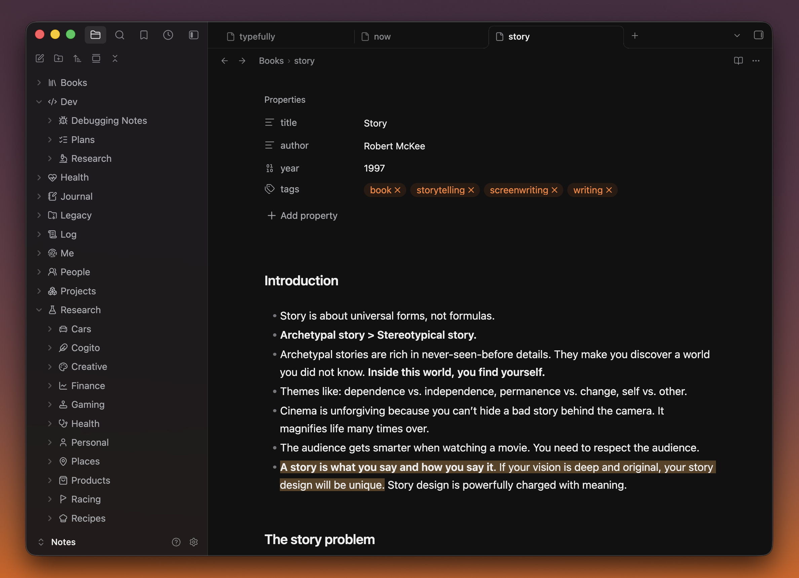

# Verso

A quiet, native-feeling standalone Obsidian theme by [Fabrizio Rinaldi](https://x.com/linuz90), inspired by the [Codex app](https://openai.com/codex/) and the clarity of [Minimal](https://github.com/kepano/obsidian-minimal) by Steph Ango (`@kepano`).

> *Verso*: the reverse side of a leaf, the left-hand page of an open book—and, in Italian, a line of poetry.

Verso refines the app as a whole with **a cleaner palette, subtler iconography, quieter details, and a more native macOS feel.**

This is a third-party community theme and is not affiliated with Obsidian or OpenAI.

## Install

### From the Obsidian Community directory

Install [Verso from the Obsidian Community directory](https://community.obsidian.md/themes/verso). You can also open **Settings → Appearance → Themes → Manage** in Obsidian, search for **Verso**, and select **Install and use**.

### Manually from a GitHub release

1. Download `manifest.json` and `theme.css` from the [latest GitHub release](https://github.com/linuz90/obsidian-verso/releases/latest).
2. Create `<your-vault>/.obsidian/themes/Verso/`.
3. Put both files inside that folder.
4. Restart Obsidian, then select **Verso** in **Settings → Appearance → Themes**.

The folder name must exactly match the `name` in `manifest.json`.

Verso requires Obsidian 1.13.7 or newer. On desktop, use installer version 1.2.7 or newer because the theme uses `color-mix()`.

## Recommended Obsidian settings

Verso works without changing Obsidian's defaults, but these settings produce the intended layout and the closest match to the screenshots:

- **Appearance**
  - **Translucent window:** On (macOS)
- **Interface**
  - **Show tab title bar:** On
  - **Show ribbon:** Off
  - **Window frame style:** Hidden
- **Editor**
  - **Inline title:** Off
  - **Readable line length:** On

## Optional sidebar icons

The folder icons shown in the screenshot come from the optional [Iconize](https://github.com/FlorianWoelki/obsidian-iconize) community plugin. Verso does not require or bundle Iconize; it simply gives monochrome sidebar icons spacing and contrast that fit the theme.

After installing Iconize, keep its default **native Lucide** pack, then right-click any file or folder and select **Change icon**. Lucide creates a restrained, consistent sidebar and requires no additional icon-pack download.

> **Tip:** To automate icon assignment, point a coding agent at `<your-vault>/.obsidian/plugins/obsidian-icon-folder/data.json`. Ask it to back up the file, preserve existing settings and mappings, and add restrained `Li...` icons only to unmapped folders. Close Obsidian before direct edits or reload it immediately afterward.

Iconize is optional and its upstream project currently describes itself as end-of-maintenance; Verso remains fully usable without it.

## Typography

Verso uses Obsidian's native system font stacks for interface, text, editor, and monospace typography. The theme never downloads fonts or other assets at runtime.

## Customization

Verso supports the generic [Style Settings](https://github.com/community-archive/obsidian-style-settings) plugin with a small theme-specific panel. It exposes line height, readable line width, maximum pane width, natural media sizing, and image-grid behavior while keeping the core palette intentional. Primary navigation stays on Obsidian's standard compact layout.

## Development

See [CONTRIBUTING.md](./CONTRIBUTING.md) for local setup and development, and [PUBLISHING.md](./PUBLISHING.md) for releases and the Community Directory checklist.

## License and attribution

Verso is released under the [MIT License](./LICENSE).

Verso began as a visual fork of [Minimal](https://github.com/kepano/obsidian-minimal). Its independent codebase retains small MIT-licensed portions of Minimal's semantic color mapping and image-grid behavior; Steph Ango retains copyright in that work, and Minimal's license is preserved in [LICENSE-Minimal](./LICENSE-Minimal).

If you enjoy the foundation Verso builds on, consider [supporting Steph's work](https://www.buymeacoffee.com/kepano).
